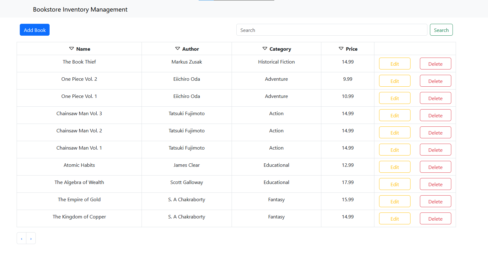
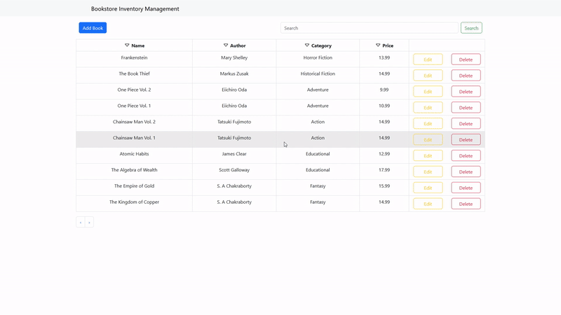
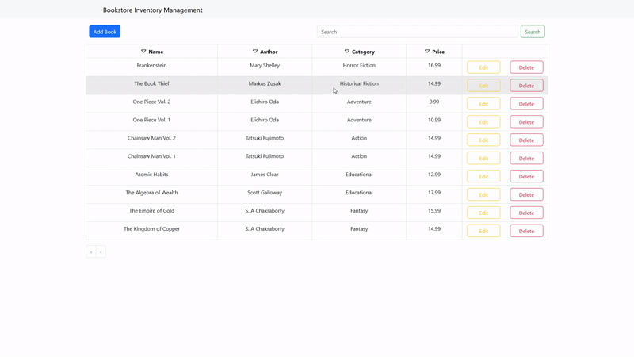
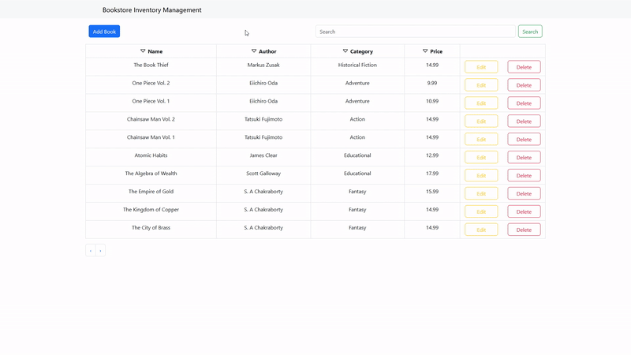
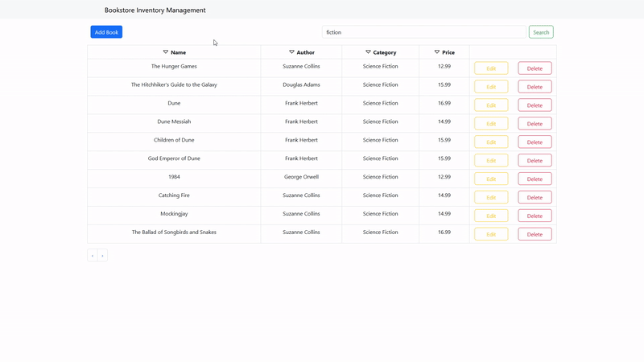
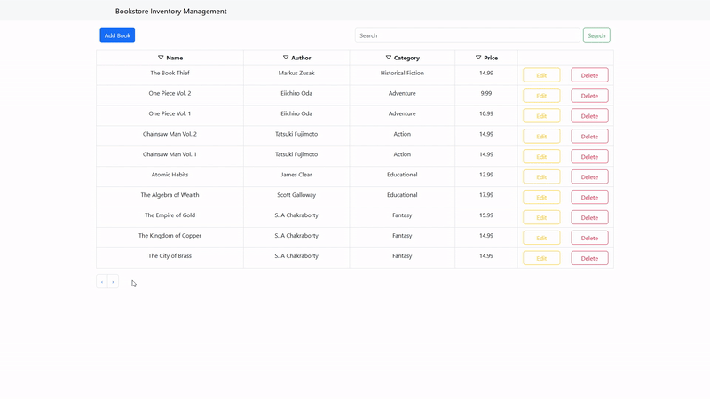

# Bookstore
Bookstore Inventory Management Project to practice full-stack development. React/Typescript frontend with Bootstrap and ASP.NET/C# backend using a MongoDB database to store book records. Users can add, edit, and delete book records from the database using the webpage. The webpage also contains a search bar to filter books by name, author or category, sorting records by clicking on the corresponding feature, and pagination. 

## On Load

## Add Book 

## Edit Book 

## Delete Book

## Search Books

## Sort Books

## Pagination

